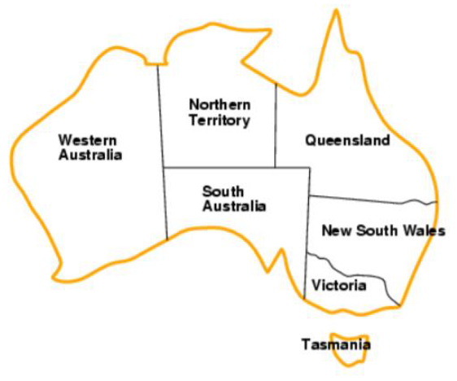
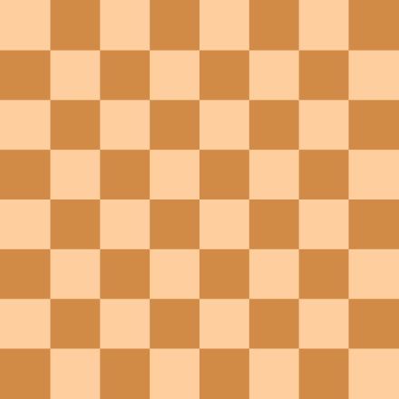
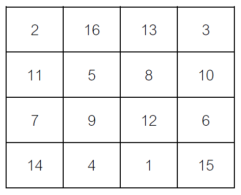

# Аудиториска вежба 5 - Проблеми кои задоволуваат услови

## Задача 1 - Боење на мапа

Дадена ни е мапата на Австралија и
треба да ја обоиме со три бои: сина,
зелена и црвена. Соседните региони не
смее да имаат иста боја. Секој регион
може да има една од трите бои.

## Задача 2 - Топови

Дадена ни е 8x8 табла за шах. Треба да
се постават 8 топови на таблата така
што ниеден топ да не се напаѓа.
Топовите може да се постават на било
која позиција која сметаме дека е
најсоодветна. Единственото
ограничување е дека не треба да се
напаѓаат.

## Задача 3 - Магичен квадрат

Магичен кв a драт е n x n квадратна матрица каде n е
бројот на ќелии на секоја страна ) пополнет со
различни природни броеви во ранг 1 ,2,….,n 2 така
што секоја ќелија содржи различен број и сумата
на секој ред, колона и дијагонала е иста Сумата се
нарекува магична константа или магична сума на
магичниот квадрат.

Даден ни е 4 x 4 магичен квадрат. Треба да ги
пополниме ќелиите со различни природни броеви
во ранг 1,2,…,16 така што секоја ќелија ќе содржи
различен број и сумата на секој ред, колона и
дијагонала ќе биде 34.

